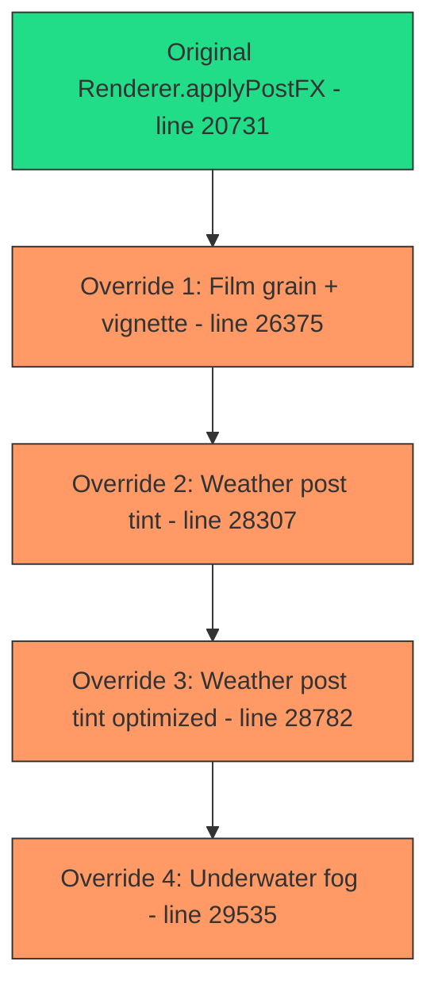
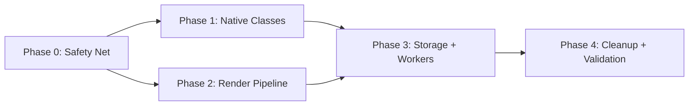
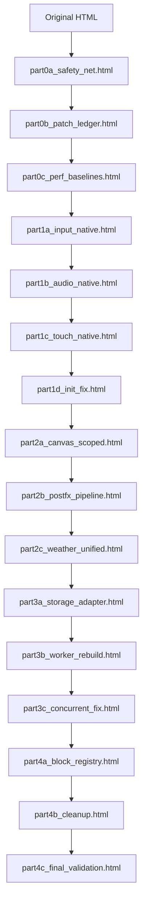

# Terraria Ultra - Architecture Governance Refactoring Plan

## Executive Summary

This plan addresses 5 critical architectural issues in a 36,767-line single-HTML Terraria clone game. All changes maintain the single-file HTML delivery constraint. Each phase produces a backup HTML and a completion report.

---

## Codebase Forensic Analysis

### File Structure
- **Single file**: `part3_game_single (6) (9)(9)(2)(6).html` - 36,767 lines
- **Lines 1-1800**: CSS styles and utility classes
- **Lines 1800-5000**: HTML markup, overlays, UI elements
- **Lines 5000-5400**: Global infrastructure (TU.Safe, EventBus, AppServices)
- **Lines 5400-8800**: Canvas optimizer, PatchRegistry, IndexedDB Storage Manager
- **Lines 8800-10100**: Game settings, AudioManager class
- **Lines 10100-11500**: BLOCK constants, BLOCK_DATA definitions, lookup tables
- **Lines 11500-14300**: TextureGenerator, ParticleSystem, WorldGenerator
- **Lines 14300-18400**: DroppedItemManager, Player class, biome config
- **Lines 18400-21000**: Renderer class (core), applyPostFX
- **Lines 21000-22900**: CraftingSystem, QualityManager, UIManager, InventoryUI
- **Lines 22900-25800**: InputManager, Game class (core), update/render loops
- **Lines 25800-27200**: Weather system, rendering overrides, chunk batching
- **Lines 27200-29000**: TileLogicEngine, patch installations (weather, audio, lifecycle)
- **Lines 29000-30800**: Biomes/mines/pumps patch, underwater fog, cloud biome, acid rain
- **Lines 30800-32200**: Worker world generation, performance packs, glow rendering
- **Lines 32200-36100**: Multiplayer, health checks, firefly system
- **Lines 36100-36767**: Final save system rewrite (dual-tier LS+IDB)

### Pain Point #1: Onion Model (applyPostFX wrapping chain)



Each override saves `prev = Renderer.prototype.applyPostFX`, then reassigns. Called per frame = 4 nested function calls + 4 closure lookups per render.

### Pain Point #2: Worker toString() Stringification

At line 31242-31250:
```
NG && parts.push(NG.toString(), "\n");
WG && parts.push(WG.toString(), "\n");
const patchNames = ["_weldStructuresFromLibrary", "_carveConnectorTunnel", ...];
// For each patched method:
const expr = _fnToExpr(fn.toString());
parts.push("WorldGenerator.prototype.", name, " = ", expr, ";\n");
```

This extracts entire class definitions and prototype patches via `.toString()`, losing closure context. Any minification breaks it completely.

### Pain Point #3: Lifecycle Race Conditions

`game:init:post` emitted in TWO places:
- Line 23913: `window.GameEvents.emit('game:init:post', this);` (inside `Game.init`)
- Line 28892: `window.GameEvents.emit("game:init:post", this);` (inside patched `Game.prototype.init`)

`SaveSystem.markTile` hijacked in THREE places:
- Line 28089: `SS.prototype.markTile` (tile logic notification)
- Line 29951: `SS.prototype.markTile` (machine index sync)
- Original at line 9327: `markTile(x, y, newId, oldId)`

### Pain Point #4: Error Swallowing

`TU.Safe.run` at line 4981 catches ALL errors and returns `opts.fallback` by default:
```javascript
function run(tag, fn, opts) {
    try { return fn(); }
    catch (e) { /* logs, but never rethrows unless opts.rethrow */ }
}
```

Found 0+ instances of bare `catch(e){console.warn('[Catch]',e);}` throughout.

### Pain Point #5: ID Drift

`allocId()` at line 29043 scans for unused IDs dynamically:
```javascript
function allocId(start) {
    const used = new Set();
    for (const k in BLOCK) used.add(0 | BLOCK[k]);
    for (let id = start; 255 > id; id++)
        if (!BD[id] && !used.has(id)) return id;
}
```

IDs for PUMP_IN, PUMP_OUT, PLATE_OFF, PLATE_ON allocated at lines 29085-29088 via sequential scanning. Loading order change = different IDs = corrupted saves.

### Additional Issues Found

- **3 separate IDB implementations**: Lines 5250, 8675 (IndexedDBStorage class), 26765, 36248
- **Global canvas hijack**: Line 5402 overrides `HTMLCanvasElement.prototype.getContext` for ALL canvases
- **17+ `__xxxInstalled` guard flags** scattered across the file

---

## Dependency Graph



---

## Phase 0: Safety Net and Performance Baselines

### Part 0A: Fix TU.Safe.run + GlobalErrorBoundary

**Target lines**: 4981-5005

**Actions**:
1. Add `runAsync(tag, asyncFn, opts)` that properly handles Promise rejections
2. Modify `run()` to log stack traces with source context, not just `[Catch]`
3. Add `GlobalErrorBoundary` that hooks `window.onerror` and `unhandledrejection`
4. Make Worker hangs, audio context failures, and IDB writes surface real errors
5. Add `__TU_ERROR_BOUNDARY__` object tracking fatal vs. recoverable errors

**Validation**: Open console, trigger an IDB write failure scenario - error must appear with full stack.

### Part 0B: Patch Ledger

**Actions**:
1. Create `TU.PatchLedger` - a manifest object listing every monkey patch with:
   - Patch ID, target class/method, line number, purpose, dependencies
2. Catalog all 17 `__xxxInstalled` flags:
   - `__tuWorldApiInstalled` (23731)
   - `__idbPatchInstalled` (26856)
   - `__chunkBatchSafeInstalled` (27094)
   - `__tileLogicInstalled` (27209)
   - `__logicLifecycleInstalled` (28060)
   - `__rainSynthInstalled` (28158)
   - `__weatherPostTintInstalled` (28304)
   - `__weatherCanvasFxRenderInstalled` (28844)
   - `__tuInputSafety` (28897)
   - `__tuLowPowerCssHook` (28953)
   - `__chestLootInstalled` (29449)
   - `__workerInstalled` (29504)
   - `__underwaterFogInstalled` (29515)
   - `__cloudBiomeSkyInstalled` (29575)
   - `__machinesInstalled` (29682)
   - `__caveReverbInstalled` (29959)
   - `__tuPoolInstalled` (32146)
3. Tag each as: ABSORB (merge into class) | EVENT (convert to listener) | PIPELINE (flatten) | KEEP

### Part 0C: Performance Baselines

**Actions**:
1. Add `TU.Profiler` with ring buffer for frame times
2. Instrument `_startRaf` callback (line 23962) to record frame duration
3. Add `game:update` duration tracking (line 24549)
4. Expose p50/p95/p99 via `TU.Profiler.stats()`
5. Add a debug overlay toggle showing live perf metrics

**Validation**: 30 seconds of gameplay produces meaningful p95/p99 numbers.

---

## Phase 1: Native Class Integration and Timing Fixes

### Part 1A: InputManager Native Merge

**Target**: `InputManager.prototype.__tuInputSafety` (line 28897), input blur/focus handlers (lines 28900-28945)

**Actions**:
1. Move blur/focus/wheel safety logic from the patch into the InputManager class constructor (around line 22900)
2. Remove the `__tuInputSafety` guard and the prototype override
3. Ensure `window.GameEvents.emit('input:set', ...)` calls remain intact

### Part 1B: AudioManager Native Merge

**Target**: `__rainSynthInstalled` (28158), `__caveReverbInstalled` (29959), `__tuAudioVisPatch` (28965)

**Actions**:
1. Merge `_makeLoopNoiseBuffer`, `_startRainSynth`, `_stopRainSynth`, `updateWeatherAmbience` into AudioManager class (line 8506)
2. Merge `_ensureCaveFx`, `setEnvironment`, enhanced `beep`/`noise`/`play` into the class
3. Remove 3 separate `__xxxInstalled` guards
4. Ensure `enabled` property is defined in constructor (fixes the bug noted at line 28964)

### Part 1C: TouchController Native Merge

**Target**: `TouchController.prototype._init` (line 25984), `_updateJoystick` (26127), `_updateCrosshair` (26139)

**Actions**:
1. Merge these methods into the TouchController class definition
2. Remove the prototype assignment pattern
3. Preserve safe-area and adaptive-radius logic

### Part 1D: Fix game:init:post Double Trigger

**Target**: Lines 23913 and 28892

**Actions**:
1. Remove the duplicate emission at line 28892 (inside the patched `Game.prototype.init`)
2. Keep only the canonical emission at line 23913
3. Add `game:init:pre` event before init logic, `game:init:post` after
4. Verify all `game:init:post` listeners fire exactly once:
   - TileLogicEngine initialization (28063)
   - Machine indexing (29765)
   - Acid rain spawn point (30715)
   - Worker initialization (31309)

**Validation**: Add a counter; `game:init:post` must fire exactly 1 time on game start.

---

## Phase 2: Render Pipeline and API Isolation

### Part 2A: Scoped CanvasOptimizer

**Target**: Lines 5402-5442 (global HTMLCanvasElement.prototype.getContext hijack)

**Actions**:
1. Remove the global prototype override
2. Create `TU.CanvasOptimizer.optimize(canvas)` that applies the alpha/fillStyle caching to a specific canvas
3. Call it only on `#game-canvas` during Renderer initialization (line 18440)
4. Other canvases (minimap, offscreen chunks, worker OffscreenCanvas) remain unaffected

### Part 2B: Flatten applyPostFX Pipeline

**Target**: 4 layers of wrapping at lines 20731, 26375, 28307, 28782, 29535

**Actions**:
1. Define `Renderer.postFxPipeline = []` as an ordered array of effect functions
2. Replace the original `applyPostFX` with a single loop:
   ```javascript
   applyPostFX(time, depth01, reducedMotion) {
       for (const fx of this.postFxPipeline) {
           fx.call(this, time, depth01, reducedMotion);
       }
   }
   ```
3. Register effects in strict order:
   - `_postFX_base` (bloom, vignette, color grading from line 20731)
   - `_postFX_filmGrain` (from line 26375)
   - `_postFX_weatherTint` (merged from lines 28307 + 28782)
   - `_postFX_underwaterFog` (from line 29535)
4. Remove all 4 `__xxxInstalled` guards for these
5. Each pipeline step is a named method, independently toggleable

### Part 2C: Weather State Consolidation

**Target**: Weather state scattered across Game.weather, CSS variables, AppServices weatherFx, multiple event handlers

**Actions**:
1. Create `game.weather` as single source of truth with typed shape:
   ```javascript
   { type, intensity, targetIntensity, nextType, nextIntensity, lightning, acid, _lightningNextAt }
   ```
2. Consolidate the 5 weather-related `game:update` listeners into one `WeatherSystem.update(dt, game)` method
3. Move CSS weather class toggling from scattered `environment:weatherChanged` handlers into a single DOM updater
4. Merge `__weatherCanvasFxPostTint` (28758) and `__weatherCanvasFxRenderInstalled` (28844) into the WeatherSystem

---

## Phase 3: Persistence Resilience and Worker Rebuild

### Part 3A: Unified StorageAdapter

**Target**: 3 separate IDB implementations at lines 5250, 8675, 26765, 36248

**Actions**:
1. Create `TU.StorageAdapter` class:
   ```javascript
   class StorageAdapter {
       async get(key) { /* try LS -> IDB -> null */ }
       async set(key, value) { /* try LS, fallback IDB, report quota */ }
       async remove(key) { /* remove from both */ }
       getMode() { /* 'ls' | 'idb' | 'degraded' */ }
   }
   ```
2. Delete the 3 redundant IDB wrapper implementations
3. Keep one canonical IDB open/get/set/del implementation
4. Expose real `QuotaExceededError` to callers instead of silently returning false
5. Merge the dual save system (KEY_FULL + KEY_LITE from line 36146) into the adapter

### Part 3B: Worker Communication Rebuild

**Target**: Lines 31161-31267 (toString() stringification)

**Actions**:
1. Replace `fn.toString()` extraction with a constant template approach:
   - Pre-build the worker source as a template string constant in the HTML
   - Include all WorldGenerator methods directly in the template
   - Use `JSON.stringify()` for data (BLOCK, BLOCK_DATA, CONFIG) transfer via `postMessage`
2. Create `PatchedWorldGenerator` as a standalone class definition within the worker template
3. Remove the `_fnToExpr` hack and the 10-method `patchNames` iteration
4. Establish proper handshake protocol: `init` -> `ack` -> `generate` -> `done`

### Part 3C: Fix Concurrent Generate and Cleanup

**Target**: Promise hanging in concurrent generate calls

**Actions**:
1. Add request ID tracking to WorldWorkerClient - each `generate()` call gets unique ID
2. Implement timeout (30s) for worker responses with fallback to main thread
3. Cancel pending generation on new `generate()` call
4. Clean `beforeunload` handler to properly terminate worker
5. Add `worker:error` and `worker:timeout` events for diagnostics

---

## Phase 4: Block Registry, Cleanup, and Validation

### Part 4A: BlockRegistry with Palette Mapping

**Target**: `allocId()` at line 29043

**Actions**:
1. Create `TU.BlockRegistry`:
   ```javascript
   class BlockRegistry {
       constructor() { this._nameToId = new Map(); this._nextDynamicId = 200; }
       register(name, definition) { /* fixed ID from definition or stable hash */ }
       getId(name) { return this._nameToId.get(name); }
       buildPalette() { /* returns {name: id} mapping for save header */ }
       applyPalette(palette) { /* remaps IDs from saved palette to current */ }
   }
   ```
2. Replace `allocId()` calls with `BlockRegistry.register()` using stable IDs
3. Add palette header to save format: `save.blockPalette = registry.buildPalette()`
4. On load, call `registry.applyPalette(save.blockPalette)` to remap any drifted IDs
5. Assign fixed IDs to PUMP_IN, PUMP_OUT, PLATE_OFF, PLATE_ON

### Part 4B: Remove Redundant Infrastructure

**Actions**:
1. Delete all 17 `__xxxInstalled` flags (now absorbed into classes)
2. Remove `TU.PatchRegistry` if all patches are absorbed
3. Remove duplicate CSS utility classes (`.tu-gpu`, `.tu-blur-*` etc. duplicated with inline styles)
4. Remove unused DOM elements and orphaned event listeners
5. Compact CSS variable definitions (merge duplicate `:root` blocks)

### Part 4C: Final Validation

**Actions**:
1. **JIT Performance**: Compare p95/p99 frame times against Phase 0 baselines
2. **IDB Degradation**: Simulate localStorage quota exceeded; verify graceful fallback
3. **Console Errors**: Must be zero `[Fatal]` errors, zero unhandled rejections
4. **Save Compatibility**: Load a save created before refactoring; verify no block corruption
5. **Worker Generation**: Generate 3 worlds consecutively; no Promise hangs
6. **Mobile Touch**: Verify joystick, jump, mining on touch device
7. **Weather Cycle**: Run through rain -> thunder -> snow -> bloodmoon -> acid rain -> clear

---

## Backup and Reporting Strategy

Each completed part produces:
- `part{N}_{phase}_{description}.html` - backup of the full HTML at that point
- Console log section in the HTML with `<!-- PHASE {N} REPORT: ... -->` comment



---

## Risk Mitigation

| Risk | Mitigation |
|------|-----------|
| Breaking save compatibility | BlockRegistry palette mapping; test with existing saves before/after |
| Performance regression from pipeline refactor | p95/p99 baselines measured in Phase 0; compare at each phase gate |
| Worker generation failure after toString removal | Keep fallback to main-thread generation; test 3x consecutive generation |
| Mobile touch regression | Test joystick, jump, mine, place on touch emulation after Phase 1C |
| IDB unavailable in private browsing | StorageAdapter already degrades to LS-only; add explicit test |

---

## Key Line References

| Component | Location | Lines |
|-----------|----------|-------|
| TU.Safe.run | Error handling | 4981-5005 |
| Canvas getContext hijack | Global prototype override | 5402-5442 |
| EventBus | window.GameEvents | 5281-5343 |
| IndexedDBStorage class | Standalone IDB wrapper | 8675-8800 |
| AudioManager class | Core audio | 8506-8670 |
| BLOCK constants | Block type definitions | 10100-10163 |
| BLOCK_DATA | Block metadata | 10164-11494 |
| TextureGenerator | Tile rendering | 11500-11700 |
| ParticleSystem | Particle effects | 14256-14700 |
| WorldGenerator | World generation | 12200-14244 |
| Player class | Player entity | 15420-15700 |
| Renderer class | Core rendering | 18440-20930 |
| Original applyPostFX | PostFX base | 20731-20928 |
| CraftingSystem | Crafting UI | 21100-21400 |
| QualityManager | Auto quality | 21500-21700 |
| UIManager | HUD/stats | 21700-22100 |
| InventoryUI | Inventory panel | 22300-22850 |
| InputManager | Keyboard/mouse | 22900-23100 |
| Game class | Core game loop | 23125-25800 |
| Game.init | Initialization | 23800-23920 |
| Game._handleInteraction | Mining/placing | 24955-25106 |
| Weather system | Weather update | 26490-26625 |
| Renderer overrides | Sky/parallax/postFX | 26146-26475 |
| Chunk batching | Tile rendering opt | 27094-27200 |
| TileLogicEngine | Fluid/wire sim | 27300-28050 |
| Weather patches | Rain/tint/FX | 28158-28870 |
| Biomes/mines patch | World gen expansion | 29009-29500 |
| Underwater/clouds | Visual patches | 29515-29680 |
| Machines/pumps | Tile machines | 29682-29960 |
| Worker generation | Off-thread worldgen | 31100-31300 |
| Performance packs | Profiling/opt | 31330-31570 |
| Glow rendering | Chunk glow pass | 31607-31930 |
| Multiplayer | WebRTC P2P | 32500-35000 |
| Final save system | Dual-tier save | 36140-36761 |
